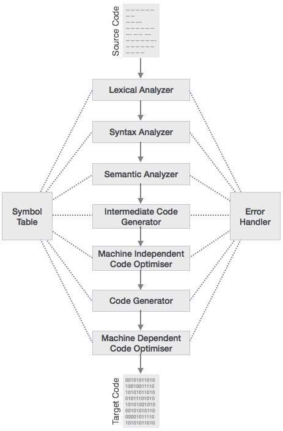
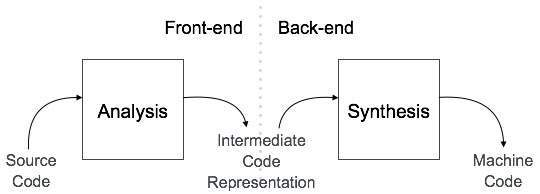

# Compiler Basics

These notes build an intuitive, high‑level picture of how compilers turn source code into running programs, and where MLIR/LLVM sit in that journey.

## Why Compilers Matter
- Bridge from human‑friendly languages to machine‑executable code.
- Catch errors early with precise diagnostics and enforce language rules.
- Make programs faster/smaller through analysis and optimisation.
- Provide reusable infrastructure that powers IDEs, static analyzers, DSLs, and ML compilers.

## What Is a Compiler?
- A compiler reads a program in a source language and emits an equivalent program in a target language.
- “Equivalent” means same observable behaviour; structure may change drastically.

### Two Common Kinds
1) Source‑to‑Source (Transpiler)
   - Input: language A → Output: language B (both high‑level).
   - Examples: TypeScript→JavaScript (tsc), modern JS→older JS (Babel), Kotlin/Scala→Java bytecode sources for tooling, SQL rewriters.
   - Use‑cases: portability, feature backports, gradual migration, cross‑ecosystem tooling.
   - Analogy: translating an English essay into French—still text, just a different language.
2) Source‑to‑Machine
   - Input: high‑level language → Output: machine code (assembly/object/binary).
   - Examples: Clang/GCC (C/C++), Rustc (Rust→LLVM IR→machine code), Go, Swift.
   - Analogy: turning an essay into precise robot instructions a machine can execute.

Many modern compilers are pipelines: front‑end → IR (often LLVM/MLIR) → back‑end.

## Language Processing System (Bird’s‑Eye View)

```
 Source Program
     |
     v
 +------------+      +-----------+      +-----------+      +--------------+
 | Preprocessor| --->|  Compiler | ---> | Assembler | ---> | Linker/Loader|
 +------------+      +-----------+      +-----------+      +--------------+
        |                 |                   |                    |
        |                 |                   |                    v
  Modified Source     Target Assembly     Relocatable           Executable /
     (optional)          Program            Object             In‑memory image
```

- Preprocessor: expands includes/macros, feature flags; outputs modified source.
- Compiler: performs analysis + optimisation; emits assembly or object files.
- Assembler: converts assembly to relocatable object code (.o/.obj).
- Linker/Loader: resolves symbols, lays out sections, produces executables and maps them into memory to run.

## Front‑End / Middle‑End / Back‑End

```
        FRONT-END                     MIDDLE-END                  BACK-END
  (language specific)           (language independent)        (target specific)
 ┌──────────┐  ┌──────────┐  ┌──────────────────────┐  ┌──────────────────────┐
 |  Lexer   |→ |  Parser  |→ |  IR + Optimisations  |→ |  Codegen + Register  |
 └──────────┘  └──────────┘  └──────────────────────┘  |  Allocation + Link  |
        ↓             ↓                  ↑              └──────────────────────┘
  tokens/lexemes   AST/Parse tree   analyses (types, CFG)        machine code
```

- Front‑end: builds structure (tokens, AST), checks meaning (types, scope), prepares IR.
- Middle‑end: improves IR with target‑independent analyses and transforms.
- Back‑end: selects instructions, allocates registers, schedules, and links.

Where MLIR/LLVM help:
- MLIR: IR family spanning high→low abstraction (dialects for tensors, loops, LLVM‑like ops).
- LLVM: low‑level IR and production‑grade backends (x86/ARM/NVPTX/AMDGPU/…).

## Full Compiler Phases (with Symbol Table & Error Handler)



- Lexical Analyzer: groups characters into tokens; records identifiers in the symbol table; emits errors like “invalid character”.
- Syntax Analyzer: checks structure against the grammar; produces a parse tree/AST; reports “unexpected token”, “missing ')'”.
- Semantic Analyzer: enforces meaning (types, declarations, l‑values); annotates the AST; can insert implicit casts; emits errors like “type mismatch”.
- Intermediate Code Generator: converts the checked AST to an IR (e.g., three‑address code, MLIR/LLVM IR).
- Machine‑Independent Optimiser: improves IR without assuming a specific CPU (e.g., constant propagation, common subexpression elimination, dead‑code elimination, loop‑invariant code motion).
- Code Generator: selects target instructions, lays out data, performs register allocation.
- Machine‑Dependent Optimiser: applies target‑aware tweaks (peephole rules, instruction scheduling, addressing‑mode selection).
- Symbol Table: shared database of names → attributes (type, scope, storage class, offsets); written and consulted throughout.
- Error Handler: centralised diagnostics with source locations; supports recovery so later phases can still proceed.

Reference diagram adapted from tutorialspoint’s quick guide to compiler design.

## Analysis vs Synthesis View (Front‑End vs Back‑End)



- Analysis (front‑end): decompose source into structure and meaning; result is an intermediate representation with metadata.
- Synthesis (back‑end): construct executable artefacts from the IR for a concrete machine.

## Guided Mini‑Example (One Statement End‑to‑End)
Input statement:
```
position = initial + rate * 60
```

1) Lexical Analysis → tokens
```
<id,position> <= <id,initial> <+> <id,rate> <*> <int,60>
```
Notes: identifiers get symbol‑table entries; literals carry values and types.

2) Syntax Analysis → tree (respect precedence: * binds tighter than +)
```
        (=)
       /   \
   (id)    (+)
  position /   \
        (id)   (*)
      initial  /   \
           (id)   (60)
            rate
```

3) Semantic Analysis → types & conversions
- Ensure names are declared; types match operations.
- If `rate: f32`, widen `60`→`60.0f` before `*`.

4) Intermediate Code (three‑address form)
```
t1 = int_to_float(60)
t2 = rate * t1
t3 = initial + t2
position = t3
```

5) Optimisation (quick taste)
```
t1 = rate * 60.0
position = initial + t1
```

6) Code Generation (illustrative ISA)
```
LDF   R2, rate
MULF  R2, R2, #60.0
LDF   R1, initial
ADDF  R1, R1, R2
STF   position, R1
```

## Compilers vs Interpreters (and Hybrids)
- Compiler: translates whole programs ahead‑of‑time; slower builds, faster runs; batch diagnostics.
- Interpreter: executes step‑by‑step; instant start, slower throughput; great for REPLs.
- Hybrid/JIT: interpret first, compile hot paths later (Java/.NET/JS engines).

## Intermediate Representations (IRs) in Practice
- High‑level IRs (AST, MLIR linalg/scf/tensor): preserve structure for algebraic/loop optimisations.
- Low‑level IRs (MLIR LLVM dialect, LLVM IR): expose explicit control/data flow for instruction selection and scheduling.
- SSA form, clear typing, and CFGs make analyses predictable and robust.

## Toolbox Quick Reference
- `flex`/`bison` or hand‑written lexers/parsers for the front‑end.
- `mlir-opt`, `mlir-translate` to inspect and transform MLIR pipelines.
- `opt`, `llc`, `clang`/`lld` for LLVM IR passes and final binaries.

## Mental Checklist per Stage
- Preconditions/postconditions, error handling, state carried forward, and transform opportunities.

Use these anchors as you dive into the detailed notes for lexing, parsing, semantics, IR, optimisation, and code generation.

## References:
- https://www.tutorialspoint.com/compiler_design/compiler_design_quick_guide.htm
