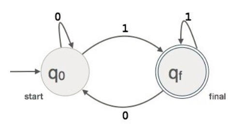
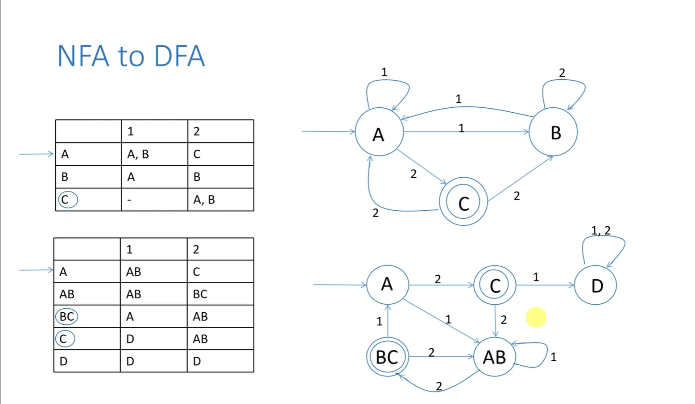

# Lexical Analysis

Lexical analysis turns raw characters into a stream of tokens the parser can understand. Think of it as turning a paragraph into words and punctuation before analysing grammar.

## Role of the Lexer (at a glance)
- Reads characters, groups them into lexemes, and emits tokens to the parser via a `getNextToken()` interface.
- Discards insignificant trivia (whitespace, comments) while tracking line/column for diagnostics.
- Records identifiers and literals in the symbol table with attributes (spelling, type hints, scope links).

```
source code --> [Lexer] --tokens--> [Parser]
                    |                    ^
                    v                    |
               Symbol Table <------------+
```

## Token, Lexeme, Pattern — the trio
- Token: the category label (e.g., `IDENT`, `NUMBER`, `PLUS`, `IF`, `EQEQ`).
- Lexeme: the exact slice of characters that matched (e.g., `score`, `3.14159`, `==`).
- Pattern: the rule that describes which lexemes belong to a token (often a regex).

Example
```
int x = 10;
```
- Tokens: `INT_KW`, `IDENT`, `ASSIGN`, `INT_LITERAL`, `SEMICOLON`
- Lexemes: `"int"`, `"x"`, `"="`, `"10"`, `";"`
- Patterns: `INT_KW := "int"`, `IDENT := [A-Za-z_][A-Za-z_0-9]*`, `INT_LITERAL := [0-9]+`, etc.

Analogy: In English, the token is “noun”, the lexeme is the concrete word “apple”, and the pattern is the dictionary rule that describes what counts as a noun in context.

## Regular expressions: the lexer's pattern language
- A regular expression (regex) is a compact way to describe a set of strings.
- The lexer uses one regex per token kind; when input matches that regex, it emits that token.
- Core building blocks (read aloud, no math needed):
  - Literals: `if`, `+`, `==`
  - Character classes: `[0-9]` is any digit; `[A-Za-z_]` is any letter or underscore
  - Concatenation: `ab` means an `a` followed by a `b`
  - Choice: `a|b` means `a` or `b`
  - Repetition: `a*` (zero or more), `a+` (one or more), `a?` (optional)
  - Grouping: `( ... )` to apply operators to a group
- Quick intuition with everyday patterns:
  - Phone like `+251-911-00 00 00`: `\+[0-9]+([- ]?[0-9]+)*`
  - Repeated `1`s: `1+` matches `1`, `11`, `111`, ...
- In compilers we stay to regex that DFAs can recognise; fancy features like backreferences are not used.

## Common token categories with patterns
- Keywords: `if|else|for|return` (usually matched before identifiers)
- Identifiers: `[A-Za-z_][A-Za-z0-9_]*`
- Integers: `[0-9]+` (extend later for hex `0x[0-9A-Fa-f]+`, binary, underscores)
- Floats: `[0-9]+\.[0-9]*([eE][+-]?[0-9]+)?` | `\.[0-9]+([eE][+-]?[0-9]+)?`
- Strings: `"([^"\\]|\\.)*"` (allows escapes like `\n`, `\"`)
- Operators: `==`, `<=`, `>=`, `!=`, `+`, `-`, `*`, `/`, `=`, `&&`, `||`
- Punctuation: `(`, `)`, `{`, `}`, `,`, `;`
- Whitespace/comments: `[ \t\r\n]+`, `//.*`, `/\*[^*]*\*+([^/*][^*]*\*+)*/`

Notes
- Multi-character operators must be recognised with priority (e.g., try `==` before `=`) to respect the longest‑match rule.
- Keywords vs identifiers: match identifier first, then check if the lexeme is in the reserved‑word set; reclassify to `IF_KW`, `ELSE_KW`, etc.

Why regex here? They precisely answer “what makes this lexeme an identifier/number/keyword?” and are easy to turn into fast automata (next topics: NFAs/DFAs and transition tables).

## Longest match and priority rules (why they matter)
- The lexer should always return the longest possible valid lexeme at a position.
  - Example: input `>=` must be `GE` not `>` followed by `=`.
- When multiple token kinds could match the same prefix, use an ordered priority (e.g., keyword table before generic identifier).

## What the lexer removes, and what it keeps
- Removes: whitespace (space, tab, newlines) and comments, unless the language treats them as significant.
- Keeps: token boundaries and source locations (line/column or byte offsets) for error messages and tooling.

## Error handling — typical cases and recovery
- Illegal character: emit an error like “unexpected character '@'”, skip it, and continue.
- Unterminated string: report starting position; consume until line end or closing quote to resynchronise.
- Bad numeric literal: e.g., `09` in a strict octal mode; either reject or interpret with a fix‑it note.
- Unknown escape `"\q"`: report and treat as literal `q` or drop the backslash.
- Recovery strategy: skip a single character or read until a safe delimiter (semicolon, newline, `}`) to avoid error cascades.

## A small, concrete walkthrough
Input
```
if (i == 0) {
  total = total + rate * 60; // update per minute
}
```
Output token stream (simplified)
```
IF_KW, LPAREN, IDENT(i), EQEQ, INT(0), RPAREN, LBRACE,
IDENT(total), ASSIGN, IDENT(total), PLUS, IDENT(rate), STAR, INT(60), SEMI,
RBRACE
```
Attributes carried alongside tokens
- `IDENT(name)`: symbol‑table entry index or string handle
- `INT(value)`: numeric value as integer or big‑int
- Each token also has `line:col` for diagnostics

## How lexers run fast (intuition)
- Regular expressions describe token patterns. Automata (DFAs) recognise them in O(n) time by scanning once.
- Tooling like Flex/RE2C/Lex turns regex sets into DFAs; hand‑written lexers simulate the same logic with explicit code.

## Finite Automata (FA) — the motor under the hood



Plain idea
- An FA is a tiny state machine that reads one character at a time and moves between states.
- If it ends in a special “accepting” state after reading a word, that word matches the pattern.

Pieces you need just enough to recognise by name
- Alphabet `Σ`: the set of input characters (ASCII/Unicode code points).
- States `Q`: dots in the diagram; one is the start state.
- Accepting states `F ⊆ Q`: double circles meaning “pattern matched here”.
- Transitions `δ(q, a) → q'`: arrows labelled by a character class such as `a`, `0–9`, or `letter`.

Why compilers care
- Each token’s regex becomes an automaton. A combined automaton scans the input once and tells you the longest token that fits.

### Reading diagrams quickly
- Circle = state; arrow into first state = start; double circle = accepting.
- Label on an arrow = which input lets you traverse that arrow.
- If no arrow matches the next character, the match fails at that point.

## DFA vs NFA (and ε‑moves) — what’s the difference?
- DFA (Deterministic FA): from any state and input character there is at most one outgoing transition. Fast to run, perfect for lexers.
- NFA (Nondeterministic FA): can have multiple possible next states, and special ε‑moves that jump without consuming input.
- Why NFAs at all? They are easy to build from regex building blocks (union `|`, concat, `*`, `+`, `?`).
- Why DFAs at runtime? Determinism → a single table lookup per character → O(n) scanning with tiny constant factors.

ε‑moves in one sentence
- Think “free teleport” between states to glue partial automata together when assembling from regex parts.

## Transition tables — diagrams as data
Instead of drawing circles and arrows, we store a table: current state × input class → next state.

Example sketch (not exhaustive)
```
State | letter  digit  '='  other
------+-----------------------------
  S   |   ID    NUM    EQ   ERR
  ID  |   ID     ID   ACC   ACC   # accepting IDENT when we stop extending
  NUM |  ACC    NUM   ACC   ACC   # accepting NUMBER when non-digit arrives
```
The lexer keeps a current state and advances one character at a time via the table.

## NFA → DFA (subset construction) — turning ideas into speed



Story version
- Regexes compile to small NFAs. To run them fast, we convert that NFA to an equivalent DFA.
- Each DFA state represents a set of NFA states (hence “subset” construction).
- This removes ambiguity (no branching at run time), enabling one next‑state lookup per character.

Practical notes
- After determinisation, we may minimise the DFA (merge equivalent states) to shrink tables.
- When multiple token regexes are combined, ties are resolved by: longest match first, then priority order (e.g., keyword before identifier).

### Tiny worked example (subset construction in plain words)
- Regex: `(ab|ac)`
  - NFA intuition: from start you can go toward the `ab` path or the `ac` path. Both paths share the first `a`.
  - DFA idea: create states that represent “sets of NFA positions”. After reading `a`, we are in a set that means “next could be `b` or `c`”. After `b` we reach one accepting spot; after `c` another. In subset notation you might see states named `AB`, `AC`, `A` … Any DFA state that includes an NFA accepting spot is itself accepting. That’s why a set like `{B,C}` would be accepting (contains an accepting `C`), while `{A,B}` would not if `A`/`B` are not accepting.

Pipeline reminder
```
Source  →  [Lexer: regex → NFA → DFA]  →  Tokens  →  [Parser: grammar]  →  AST
```

Performance notes
- DFA runs in O(n) with one table lookup per character.
- Big DFAs are sometimes minimised or table‑compressed to reduce memory.

## Mini patterns table (informal)
| Token | Pattern idea | Example lexemes |
| --- | --- | --- |
| `IF_KW` | the literal `if` | `if` |
| `ELSE_KW` | the literal `else` | `else` |
| `COMP_OP` | one of `<`, `>`, `<=`, `>=`, `==`, `!=` | `<=`, `!=` |
| `NUMBER` | any numeric constant | `3.14159`, `0`, `6.02e23` |
| `STRING` | characters in quotes with escapes | `"apple"`, `"line\n"` |
| `IDENT` | letter/underscore then letters/digits/underscores | `pi`, `score`, `D2` |

## Practical tips for building your own
- Track both raw lexemes and normalised forms (e.g., unescaped strings, numeric value as 64‑bit/BigInt).
- Prefer immutable token objects; store lexeme slices as views into the original buffer to avoid copies.
- Keep a keyword hash set to reclassify identifiers without extra scans.
- Add a `peek()` or 1‑token lookahead buffer for the parser.
- Always include source locations in tokens; error quality depends on it.

Symbol table note
- Identifiers typically get an entry as soon as the lexer first sees them (spelling, maybe a unique id). Later phases add type, scope, storage info.
- Literal pooling is optional but handy: store interned strings or folded numeric values for reuse.

## Quick self‑check
- Can you define token vs lexeme vs pattern in your own words?
- For the snippet `x += 1;`, what tokens should be produced? What if the language doesn’t support `+=`?
- How would you recover from `"unterminated string`?

---

## Edge‑case gallery (ambiguous or tricky inputs)

These are the situations that usually trip early lexers. Treat them as mini tests.

- Multi‑char vs single‑char operators
  - Input: `a>=b` → tokens: `IDENT(a) GE IDENT(b)`; not `GT ASSIGN`.
  - Input: `a==b` → tokens: `EQEQ`, not `ASSIGN EQ`.
- Comment vs operator
  - Input: `x--y` (language with decrement op) → `IDENT(x) DEC IDENT(y)`.
  - Input: `x- -y` (space inserted) → `IDENT(x) MINUS MINUS IDENT(y)`.
  - Input: `a/ *b* /c` (spaces inside) should be `DIV STAR IDENT(b) STAR DIV IDENT(c)` not a block comment.
- Numbers
  - Hex with prefix: `0x2A` → `INT(42)`; pattern: `0[xX][0-9A-Fa-f]+`.
  - Binary (if supported): `0b1010_0101` (allow underscores) → strip `_` during normalisation.
  - Floats: `.5` vs `0.5` — decide which forms are allowed; be explicit in patterns.
- Strings
  - Escapes: `""` inside a string becomes one `"` in the value; invalid `\q` should error with position.
  - Raw strings (if supported) skip escapes: `r"C:\temp\file"` keeps backslashes.
- Identifiers vs keywords
  - `if1` is an identifier; `if` is a keyword. Implement by scanning as identifier, then reclassifying by a reserved set.
- Newlines
  - Some languages treat newline as a token (`NEWLINE`) for off‑side rules (e.g., Python); others ignore it.

## Extra pattern cheatsheet (more realistic languages)

```
HEX_INT     := 0[xX][0-9A-Fa-f]_*
BIN_INT     := 0[bB][01]_*
OCT_INT     := 0[oO][0-7]_*
DEC_INT     := [0-9](?:[0-9_]*[0-9])?
FLOAT       := (?:[0-9]+\.[0-9]*|\.[0-9]+)(?:[eE][+-]?[0-9]+)? | [0-9]+[eE][+-]?[0-9]+
IDENT_ASCII := [A-Za-z_][A-Za-z0-9_]*
IDENT_UNI   := \p{L}[\p{L}\p{N}_]*    # if your regex engine supports Unicode classes
LINE_COMMENT:= //[^\n]*
BLOCK_COMM  := /\*[^*]*\*+(?:[^/*][^*]*\*+)*/
WS          := [\t\n\r ]+
```

Notes:
- Normalise numeric literals by removing underscores and computing the value in the correct base.
- Keep both raw and cooked string forms if later stages need original spelling (e.g., for error messages).

## Small practice (answers shown)

Input A
```
sum+=value--*0x10
```
Tokens
```
IDENT(sum) PLUSEQ IDENT(value) DEC STAR HEX_INT(16)
```

Input B
```
"hello\nworld"  r"hello\nworld"
```
Tokens
```
STRING(value="hello\nworld")  RAW_STRING(value="hello\\nworld")
```

Input C
```
/* start /* nested? */ end */
```
Tip: classic C‑style comments do not nest; decide your language’s rule and implement block‑comment scanning accordingly.

---

## Direct answer to a common doubt (“invalid token?”)
- The lexer (DFA) never “corrects” what you meant; it only recognises patterns.
- If you type `whale` instead of `while`, that’s a perfectly valid `IDENT` token. The parser later complains if it expected the `WHILE` keyword.
- Truly invalid tokens are slices that match no token regex at all (e.g., `@123` in C‑like languages) — those trigger lexical errors.

---

## FAQ (quick answers to common doubts)

- What do DFAs actually do in a compiler?
  - Recognise tokens. In practice they do both jobs at once: split the input into token‑sized chunks and classify each chunk by token kind.
  - Example: `while(x==10)` → `WHILE`, `LPAREN`, `IDENT(x)`, `EQEQ`, `INT(10)`, `RPAREN`.

- Does the scanner do both splitting and classifying?
  - Yes. The DFA drives longest‑match to decide token boundaries (splitting) and the matched pattern determines the token type (classifying).

- “whale” vs “while” — will the lexer complain?
  - No. `whale` matches the identifier regex, so it’s lexically valid. The parser flags an error only if that position required the `while` keyword.

- Who checks meaning, then?
  - Lexer: well‑formed tokens only.
  - Parser: token order against grammar (e.g., expects `while` `(` expr `)` stmt).
  - Semantic analysis: names declared, types compatible, etc.

- Why convert NFA → DFA at all?
  - NFAs are easy to build from regexes; DFAs are fast to run (single table lookup per char). Determinisation gets you linear‑time scanning.

- “Invalid token” vs “Unexpected token” — what’s the difference?
  - Invalid token: the character slice matches no token regex → lexer error.
  - Unexpected token: it’s a valid token, but the grammar doesn’t allow it there → parser error.

Pipeline (one‑liner reminder)
```
Source → [Lexer: regex→NFA→DFA] → Tokens → [Parser: grammar] → AST → [Semantic] → IR
```
