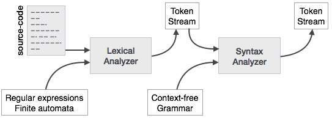
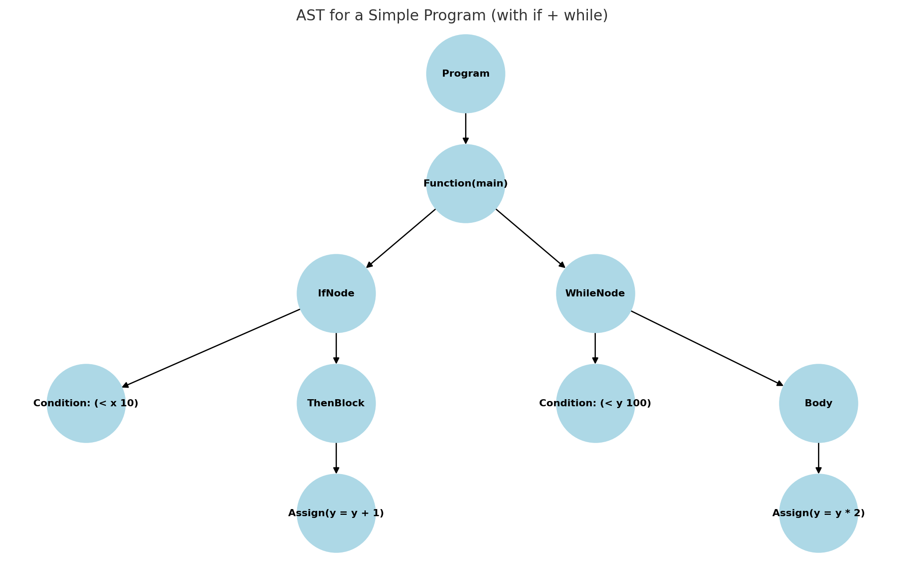
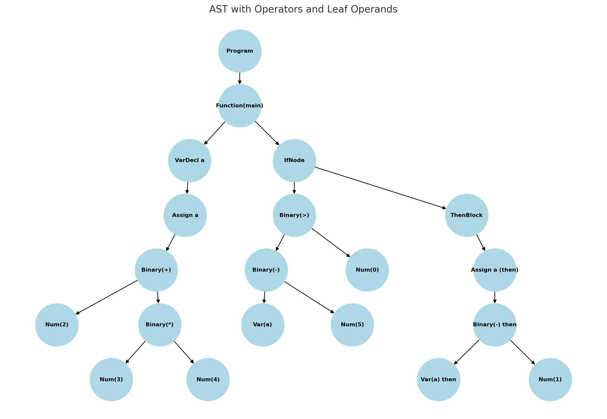

# Syntax Analysis

Goal: take the token stream from the lexer and check whether it forms a valid sentence in the language grammar; build a tree structure (parse tree/AST) that captures the program’s structure.

## Role of the parser (big picture)



- Input: token stream from the lexer.
- Knowledge: a grammar that defines valid sentence shapes.
- Output: a tree (parse tree first, then AST) or a clear syntax error.

## Core vocabulary (quick and friendly)
- Grammar G = (T, N, P, S)
  - `T` terminals: token kinds from the lexer (e.g., IDENT, PLUS, INT).
  - `N` nonterminals: syntactic categories (Expr, Term, Factor, Stmt).
  - `P` productions: rules like `Expr → Term ((+|-) Term)*`.
  - `S` start symbol (e.g., Program).
- Parse tree: shows every rule application; great for proofs, noisy for compilers.
- AST (abstract syntax tree): drops punctuation and derives operator nodes; what compilers actually use.

Context‑free grammar (CFG) in plain English
- “Context‑free” means a rule’s left‑hand side is a single nonterminal and the rule does not depend on what’s around it.
- Terminals are the leaves you already know: actual token kinds (IF, WHILE, IDENT, INT, `+`, `(`, …).
- Nonterminals are buckets like `Expr`, `Stmt`, `Block` that expand via rules into terminals/nonterminals.
- Productions are the recipes; the start symbol is the top‑level recipe (e.g., `Program`).

Why CFGs for programming languages?
- Capture hierarchy naturally (program → function → statement → expression).
- Make parsers systematic and maintainable; we can change rules without rewriting the whole parser.

### The four parts of a CFG (plain English)
A CFG = (Terminals, Nonterminals, Productions, StartSymbol)

1) Terminals — the tokens from the lexer (actual words/symbols)
   - Examples: `IF`, `WHILE`, `IDENT`, `INT`, `+`, `*`, `=`, `(`, `)`, `{`, `}`, `;`
2) Nonterminals — syntactic variables (names for phrases the parser builds)
   - Examples: `Expr`, `Term`, `Factor`, `Stmt`, `StmtList`, `Program`
3) Productions (rules) — how to expand a nonterminal into smaller parts
   - Example: `Expr → Expr + Term | Term`
4) Start symbol — the top‑level thing to build
   - Often `Program`

Analogy to English
- Terminals = words ("if", "while", ";")
- Nonterminals = parts of speech/phrases (Sentence, NounPhrase)
- Productions = grammar rules (Sentence → NounPhrase VerbPhrase)
- Start = Sentence

## From tokens to trees (high‑level flow)
```
Tokens → [Parser] → Parse Tree → [AST builder/simplifier] → AST
```

See also: `03-2-syntax-analysis.md` for a friendlier deep‑dive on E/T/F, derivations (left‑most vs right‑most), removing left recursion, and left factoring — all with step‑by‑step examples and analogies.

## Expression grammar starter (precedence/associativity encoded)
```
Expr   → Term ((+ | -) Term)*
Term   → Factor ((* | /) Factor)*
Factor → INT | IDENT | '(' Expr ')'
```
- `*`/`/` bind tighter than `+`/`-`.
- All binary ops here are left‑associative.

Example parse (tokens for `a + b * 60`)
```
        (+)
       /   \
    (id a)  (*)
           /   \
        (id b) (60)
```

## Concrete AST examples (operators + leaves)

Simple program
```c
function main() {
  if (x < 10) {
    y = y + 1;
  }
  while (y < 100) {
    y = y * 2;
  }
}
```

AST structure to look for
- Root: Program
  - Function(main)
    - IfNode: condition `< x 10`; then → Assign `y = y + 1`
    - WhileNode: condition `< y 100`; body → Assign `y = y * 2`

Diagram


Tiny arithmetic/if example (operators as internal nodes, identifiers/literals as leaves)

```c
function main() {
  let a = 2 + 3 * 4;
  if (a - 5 > 0) { a = a - 1; }
}
```

Diagram


What to notice
- `Binary(+)` has children `Num(2)` and `Binary(*)`; `Binary(*)` has `Num(3)` and `Num(4)`.
- `if` condition is `Binary(>)` whose left is `Binary(-)` (Var(a), Num(5)) and right is `Num(0)`.
- Leaves are numbers/variables; internal nodes are operators/statements.

Minimal AST node sketch (language‑agnostic pseudocode)
```cpp
// Base
struct Node { virtual ~Node() {} };

// Expressions
struct Number : Node { int value; };
struct Var    : Node { string name; };
struct Binary : Node { string op; Node* left; Node* right; }; // op in {+,-,*,/,<,>,==,...}

// Statements
struct Assign    : Node { Var* lhs; Node* rhs; };
struct IfNode    : Node { Node* condition; vector<Node*> then_block; vector<Node*> else_block; };
struct WhileNode : Node { Node* condition; vector<Node*> body; };
struct FuncDef   : Node { string name; vector<Node*> body; };
struct Program   : Node { vector<FuncDef*> functions; };
```

Why parentheses and keywords look “dropped” in ASTs
- Parentheses are just for grouping; once precedence is encoded by the tree, extra `()` are unnecessary and omitted.
- Keywords are not stored as raw strings; they determine the node type (e.g., token `while` → AST kind `WhileNode`).

## Common grammar issues and fixes
- Ambiguity: a string has more than one parse tree.
  - Example: `if E then S else S` without precedence rules is ambiguous.
  - Fix: encode precedence/associativity in the grammar or in parser conflict rules.
- Left recursion (problematic for LL/recursive‑descent): `A → A α | β`.
  - Eliminate by rewriting: `A → β R`, `R → α R | ε`.
  - Immediate vs indirect left recursion—remove both for LL parsers.
- Left factoring (predictive choice): when two alternatives share a prefix, factor it out.
  - `Stmt → if Expr then Stmt else Stmt | if Expr then Stmt`
  - Factor to: `Stmt → if Expr then Stmt Stmt'`, `Stmt' → else Stmt | ε`.

## FIRST and FOLLOW (intuition first)
- `FIRST(X)`: which tokens can start strings derived from `X`.
- `FOLLOW(X)`: which tokens can appear immediately after `X` in some sentential form.
- For LL(1): each nonterminal’s alternatives must have disjoint `FIRST` sets (and use `FOLLOW` when ε is involved).

Tiny table memory aid
```
If A → α | β is in the grammar, LL(1) needs:
FIRST(α) ∩ FIRST(β) = ∅
If ε ∈ FIRST(α), then FIRST(β) ∩ FOLLOW(A) = ∅ (and vice‑versa)
```

## LL(1) predictive parsing (hand‑written friendly)
- Compute FIRST/FOLLOW.
- Build a parse table: row = nonterminal, column = lookahead token; entry = which production to use.
- Driver uses one token of lookahead and a stack to expand nonterminals.

Pseudo‑driver sketch
```
stack ← [S, $]
look  ← nextToken()
loop:
  top ← stack.pop()
  if top is terminal:
     if top == look: look ← nextToken(); continue
     else: error("unexpected token")
  else: # nonterminal
     prod ← TABLE[top, look]
     if prod is empty: error("no rule applies")
     push RHS(prod) onto stack in reverse order
```

## LR family (conceptual only here)
- LR parsers read left‑to‑right and produce rightmost derivations in reverse using a shift/reduce stack machine.
- They handle a broader class of grammars than LL(1) and are used by many generators (Yacc/Bison, LALR(1), GLR).
- Mental model: the table says “shift” (read a token) or “reduce” (collapse a sequence to a nonterminal) until you accept.

## Building ASTs during parsing
- With recursive descent: return node objects from functions `parseExpr`, `parseTerm`, etc.
- With table‑driven parsers: use semantic actions attached to rules to build nodes on reductions.
- Strip punctuation; store operator kind and child pointers. Keep token spans (start..end) for diagnostics.

## Error handling (short and practical)
- Panic mode: on error, discard input tokens up to a synchronising set (e.g., `;` or `}`) and resume.
- Phrase‑level repair: insert/delete a small number of tokens to continue (use sparingly).
- Good messages: report expected tokens vs found; show the source span of the construct.

## Worked mini‑example — recursive descent for Factor
```
Node* parseFactor() {
  if (match(INT))    return makeIntNode(prevToken());
  if (match(IDENT))  return makeIdNode(prevToken());
  if (match(LPAREN)) {
    Node* e = parseExpr();
    expect(RPAREN, ")");
    return e;
  }
  error("expected INT, IDENT, or '('");
}
```

## Checklist
- [ ] Derive FIRST/FOLLOW for the expression grammar above.
- [ ] Sketch an LL(1) table and verify disjointness.
- [ ] Try one tiny LR(0)/SLR(1) example to see shift/reduce in action.
- [ ] Capture at least one error‑recovery synchronising set for your toy language.

## FAQ
- What are terminals vs nonterminals in real terms?
  - Terminals are token kinds from the lexer (`IDENT`, `INT`, `PLUS`, `IF`). Nonterminals are grammar categories like `Expr`, `Stmt`, `Block` that expand into terminals/nonterminals.
- Is AST the same as a parse tree?
  - No. Parse trees show every grammar symbol; ASTs drop punctuation and compress chains. ASTs are the compact representation compilers transform.
- Why remove left recursion only for LL parsers?
  - LL uses top‑down expansion that would loop on `A → A α`. LR is bottom‑up and handles many left‑recursive patterns naturally.
- How does precedence work if I don’t bake it into the grammar?
  - Either use precedence/associativity declarations in a parser generator or use Pratt/precedence‑climbing parsing in a hand‑written parser.
- Do I need FIRST/FOLLOW if I’m hand‑writing a recursive‑descent parser?
  - They’re still useful to reason about predictability and to design good error messages, even if you don’t compute full tables.
- Why does the AST “drop” parentheses and keywords?
  - Parentheses: tree structure already captures grouping. Keywords: encoded as node kinds (`IfNode`, `WhileNode`) rather than stored as strings.
